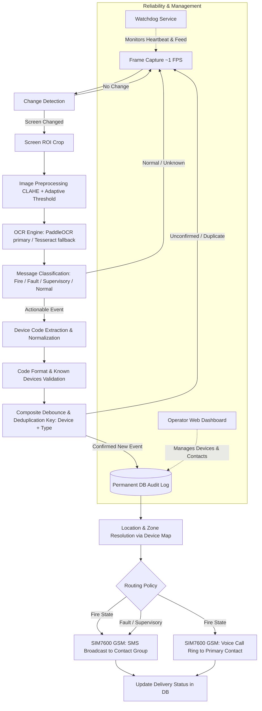

# FDAS Alarm Notification System — Comprehensive Project Progress Report

**Project:** Supplementary Optical Fire Detection & Alarm Notification System (FDAS)  
**Client / Site:** Bekaert Facility (Industrial Manufacturing Plant)  
**Target Hardware:** Raspberry Pi (ARM64 / Linux) + Pi HQ Camera + SIM7600 4G GSM Module  
**Monitored Panel:** Honeywell Fire Alarm Control Panel (Loop 1 & Loop 2 Display)  
**Report Generated:** October 2026  
**Status:** Core Software Pipeline & UI Complete (64/64 Tests Passing) | Transitioning to Physical Rig Deployment & Live GSM Soak Testing

---

## Executive Summary

The **FDAS Alarm Notification System** is a non-intrusive, optical monitoring and cellular notification layer designed for the Bekaert industrial facility. By mounting an independent camera in front of an unmodified, certified Honeywell fire alarm panel, the system continuously observes the panel screen, detects textual state changes, extracts alphanumeric device codes via Computer Vision and Optical Character Recognition (OCR), maps them against plant floor locations, and immediately dispatches cellular SMS and voice call alerts over a dedicated GSM module (SIM7600).

The system operates strictly as a **supplementary notification layer** — it never interferes with, modifies, or replaces the certified FDAS panel, sounders, or plant sirens.

All core software components — full-screen OCR, change detection, keyword and fuzzy message classification, composite-key debouncing and deduplication, location resolution across 113 real Bekaert devices, AT-command GSM drivers, watchdog health monitoring, and a password-protected web operator dashboard — are **fully implemented and verified**. The unit and integration test suite currently boasts a **100% pass rate (64 of 64 tests passing)**.

The project is entering its final deployment and site-commissioning phase, focusing on physical mounting, optical calibration, live cellular SIM verification, and multi-day soak testing.

---

## 1. Project Context & Objectives

### 1.1 Problem Statement & Operational Need
In large industrial facilities like Bekaert, the main fire alarm control panel is located in a central control room or security station. When a detector (smoke, heat, or manual call point) activates, plant safety officers or on-call emergency response teams stationed away from the central panel may experience delays before the exact zone and device identification is relayed. 

Modifying the internal wiring or digital bus of an existing certified life-safety panel voids manufacturer warranties and regulatory compliance. An external, non-invasive optical reading solution bridges this communication gap safely.

### 1.2 Key Objectives & Success Criteria
1. **Zero Panel Intrusion:** Pure optical capture; zero physical or electrical connection to the life-safety panel.
2. **Rapid Notification:** SMS alert delivered within seconds of an alarm appearing on the display.
3. **Escalated Voice Alert for Fire:** Immediate ring-only phone call placed for confirmed `FIRE` conditions to ensure off-hook attention.
4. **Complete Audit Trail:** Every event logged permanently to a local SQLite database prior to notification dispatch.
5. **High False-Positive Rejection:** Intelligent multi-frame debouncing to eliminate false alerts from optical glare, reflections, or transient flicker.
6. **State-Change Sensitivity:** Duplicate suppression for static alarms, but immediate alerting if a device escalates from `FAULT` to `FIRE`.
7. **Autonomous Reliability:** Self-monitoring watchdog service capable of detecting camera obstruction, pipeline process crashes, or stalled execution.

---

## 2. Architecture & Pipeline Evolution

### 2.1 Post-Site-Visit Architecture Pivot
The original design (detailed in the initial proposal) planned to use an LED indicator as a hardware trigger/classifier, coupled with a fixed-box crop around the device code. During the industry site visit at Bekaert, team observations revealed:
- Panel LEDs cannot be reliably used as triggers or message classifiers due to environmental reflection, variable blink states, and shared status indicators.
- Device codes appear alongside multi-line text descriptions indicating message severity (`Fire`, `Fault`, `Disablement`, `Delayed Mode`).
- Device codes exist in both short slash format (`L1/53`) and long canonical format (`L1 A053`).

**Architectural Update:** The system was re-engineered into a continuous optical interpretation pipeline reading the entire screen area, using algorithmic change detection to preserve CPU resources, and classifying events via full-screen text analysis.

---

## 3. Team Roles & Ownership

The project was structured across six distinct functional roles as outlined in the Project Charter:

| Role / Identifier | Area of Ownership | Assigned Responsibilities | Primary Deliverables |
| :--- | :--- | :--- | :--- |
| **Member 1** | **Hardware & Calibration** | Physical bracket design, camera mounting, anti-glare filtration, screen ROI coordinates, known device list. | Rig assembly, `hardware/calibration.json`, `known_devices.txt`. |
| **Member 2** | **Computer Vision & OCR** | Frame acquisition, frame change detection, screen cropping, image preprocessing, OCR engines, keyword & fuzzy classification, code extraction & normalization. | `cv/capture.py`, `cv/change_detect.py`, `cv/ocr.py`, `cv/classify.py`, `cv/validate.py`. |
| **Member 3** | **Backend & Pipeline** | Multi-frame debouncing, composite-key deduplication, location resolution, SQLite database schema & migrations, routing policies, central pipeline coordinator. | `backend/pipeline.py`, `backend/debounce.py`, `backend/location.py`, `backend/routing.py`, `backend/db.py`. |
| **Member 4** | **Notifications (GSM)** | SIM7600 serial communication, AT command sequence implementation, SMS templating & retries, blank voice call dialing, resolution tracking. | `notify/sms_gateway.py`, `notify/voice_call.py`, `notify/gsm_config.py`, `notify/resolve.py`. |
| **Member 5** | **Reliability & DevOps** | System health monitor daemon, process supervision, camera feed health check, systemd unit services configuration, Pi packaging. | `watchdog/health_monitor.py`, `watchdog/systemd/*.service`. |
| **Member 6** | **QA, Integration & UI** | Test harness, synthetic footage generator, end-to-end integration tests, real panel image replication & validation, Flask Operator Dashboard. | `tests/`, `ui/`, `run_live.py`, test plans & documentation. |

---

## 4. Completed Work & Technical Achievements

### 4.1 Computer Vision & Text Extraction (`cv/`)
- **Multi-Source Ingestion (`cv/capture.py`):** Unified video capture abstraction that runs seamlessly against a live USB/Pi camera index (`0`), video files (`.mp4`), or image directories. Incorporates black-frame and overexposure sanity guards.
- **Efficient Change Detection (`cv/change_detect.py`):** Measures mean absolute pixel differences between consecutive frames within the configured screen ROI. Only triggers computationally expensive OCR when the delta exceeds `change_threshold` (default 8.0), reducing CPU load and thermal throttling on the Raspberry Pi during 24/7 idle operation.
- **Image Preprocessing (`cv/preprocess.py`):** Converts cropped display images to grayscale, applies Contrast Limited Adaptive Histogram Equalization (CLAHE, clip limit 2.0, grid 8x8), and runs adaptive Gaussian thresholding to make matrix LCD text razor-sharp for OCR.
- **Dual OCR Architecture (`cv/ocr.py`):**
  - **PaddleOCR (Primary):** Achieves >96% character confidence on dot-matrix LCD text.
  - **Tesseract OCR (Fallback):** Invoked with PSM 6 (uniform text block) using dual-pass image processing (RGB and inverted binary) to ensure resilience if PaddleOCR is unavailable.
- **Raspberry Pi ARM64 Workaround:** Solved native C++ segfault crashes on Raspberry Pi OS 64-bit by setting environment variables (`FLAGS_use_mkldnn=0`, `FLAGS_use_xdnn=0`, `OMP_NUM_THREADS=1`) prior to library imports and selecting the lightweight `.ocr()` API with PP-OCRv3 models.
- **Fuzzy Message Classification (`cv/classify.py`):**
  - Two-pass classification engine. Pass 1 checks exact substrings against real panel vocabulary (`Fire`, `First Fire`, `Latest Fire`, `Fault`, `System Fault`, `Sounder Fault`, `Supply Fault`, `Earth Fault`, `Disablement`, `Delayed Mode`, `Sounders Disabled`, etc.).
  - Pass 2 applies sliding-window fuzzy matching using `difflib.SequenceMatcher` (threshold 0.82) to correctly identify message intent even when character degradation occurs.
- **LCD Code Normalization & Regex Extraction (`cv/validate.py`):**
  - Dual-pattern regex parsing both canonical long format (`L1 A053`) and description short format (`L1/53`), normalising both to `L<loop> A<device>`.
  - Intelligent character correction table resolving common LCD optical ambiguities (e.g., `Li` $\rightarrow$ `L1`, `Alia` $\rightarrow$ `A114`).
  - Prefix auto-correction: detects misread leading letters (e.g., `L2 R138`) and automatically checks the Bekaert `A`-prefix canonical form (`L2 A138`) against the known devices registry.

### 4.2 Backend & Data Integrity (`backend/`)
- **Robust SQLite Storage (`backend/schema.sql`, `backend/db.py`):**
  - `events`: Tracks every event with ISO 8601 timestamps, device code, message type, raw OCR string, resolved location, zone, device type, SMS delivery status, retry attempts, and call status.
  - `device_map`: Centralized registry linking panel codes to physical locations, zones, device types, and contact numbers.
  - `system_health`: Real-time audit log of watchdog health checks.
  - `notification_contacts`: Global distribution lists for SMS and Voice Call routing.
- **Composite Debounce & Deduplication (`backend/debounce.py`):**
  - Multi-frame confirmation requirement (`required_consecutive=2` or `3` within a 5-second sliding window) prevents transient noise, physical vibration, or lightning flicker from producing false alarms.
  - Deduplication key is strictly composite: `(device_code, message_type)`. If device `L1 A053` is active as a `fault`, a subsequent `fire` detection on the same device immediately bypasses deduplication, triggering the higher-priority fire response.
- **Pre-Notification Logging (`backend/location.py`):**
  - Event records are committed to SQLite **before** any cellular dispatch is attempted, guaranteeing an immutable audit trail even if the GSM module fails or power cuts occur.
- **Routing Engine (`backend/routing.py`):**
  - Fire: SMS dispatch to contact group + immediate blank voice call to primary responder.
  - Fault / Supervisory: SMS dispatch only.
  - Normal / Unknown: Suppressed; zero notification noise.

### 4.3 Industrial Device Map Seeding (`hardware/`)
- **Bekaert Plant Floor Integration (`hardware/seed_device_map.py`):**
  - Successfully imported and parsed the real Bekaert commissioning document: `Appliance_location.xlsx`.
  - Extracted, cleaned, and seeded **113 physical devices** spanning Loop 1 and Loop 2 into the database and `known_devices.txt`.
  - Mapped device type abbreviations: SD (Smoke Detector: 76), MD (Multi-Detector: 34), HD (Heat Detector: 2), MCP (Manual Call Point: 1).
  - Categorized across 17 distinct plant zones: Mixing Area (28), Admin Office (17), C Drawing Area (17), Chiller Room (10), B Drawing Area (9), QA Rooms (8), Boiler Room (6), New Building (6), etc.

### 4.4 Cellular Notification Engine (`notify/`)
- **GSM Hardware Abstraction (`notify/gsm_config.py`):** Central configuration targeting the SIM7600 4G LTE cellular HAT (`/dev/ttyUSB2` at 115200 baud).
- **Direct AT Command SMS (`notify/sms_gateway.py`):**
  - Formats human-readable, actionable SMS text:
    `"FIRE ALARM: L1 A053 [SD (smoke detector)] at B Drawing Area - ABV B100 MC, Zone: B Drawing Area. Respond immediately."`
  - Robust state machine handling `AT+CMGF=1` and `AT+CMGS` with a 3-tier exponential backoff retry policy (0s, 2s, 5s) and automatic failure escalation marking.
  - Integrated `dry_run` mode enabling safe offline testing.
- **Ring-Only Voice Call (`notify/voice_call.py`):**
  - Sends `ATD<number>;` over serial, rings the designated emergency phone for 15 seconds (`CALL_RING_SECONDS`), and cleanly hangs up with `ATH`. No synthetic voice or audio playback needed; the physical ring acts as an urgent alert.
- **Resolution Tracking (`notify/resolve.py`):** Automatically clears the active state registry when the panel display returns to normal.

### 4.5 Reliability & Watchdog (`watchdog/`)
- **Independent Daemon (`watchdog/health_monitor.py`):** Runs outside the main pipeline process to monitor:
  - Pipeline heartbeat timestamp freshness (`/tmp/fdas_heartbeat`).
  - Video frame illumination (black/white obstruction check).
  - Process table vitality (via `psutil`).
  - Periodically logs status into `system_health` and auto-prunes historical checks.
- **Systemd Production Units (`watchdog/systemd/`):**
  - `fdas-pipeline.service`: Pipeline daemon with automatic restart on failure (`Restart=on-failure`, `RestartSec=5`).
  - `watchdog/systemd/fdas-watchdog.service`: Independent watchdog service.
  - `watchdog/systemd/fdas-ui.service`: Web interface daemon.

### 4.6 Operator Dashboard UI (`ui/`)
- **Flask Web Application (`ui/app.py`):** Lightweight, responsive dashboard accessible by facility operators over the local plant LAN.
- **Security & Session Management (`ui/auth.py`):** Password-authenticated sessions with CLI credential management (`python -m ui.auth set-password`).
- **Live System Status Banner:** Pulls the latest watchdog checks to provide a real-time status banner (`All systems operating normally` or highlighted fault reasons) with a 10-second auto-refresh.
- **Event History View:** Complete tabular display of logged alarms, timestamps, message types, locations, and cellular delivery statuses.
- **Device Map Spreadsheet Manager (`ui/views/upload.py`):**
  - Allows facility managers to upload updated `.xlsx` device maps directly via the browser.
  - Parses and validates format integrity using `openpyxl`.
  - Provides a downloadable standard template (`ui/static/template.xlsx`).
- **Global Contact Configuration:** Web interface to view and modify global SMS and voice call phone numbers without editing code or restarting services.

### 4.7 Testing & Diagnostic Tooling (`tests/` & `run_live.py`)
- **Automated Test Suite:** **64 tests across 7 test modules, all passing (100% success rate)**:
  - `test_validate.py`: Regular expressions, prefix correction, and whitelist checks.
  - `test_classify.py`: Exact and fuzzy vocabulary matching across fire, fault, and supervisory conditions.
  - `test_change_detect.py`: Frame difference thresholds and ROI cropping.
  - `test_debounce.py`: Multi-read confirmation and composite-key state transitions.
  - `test_routing.py`: Message-to-action policy verification.
  - `test_pipeline_e2e.py`: End-to-end integration from event ingestion to DB write and simulated SMS/call.
  - `test_ui_integration.py`: Flask route rendering, session authentication, and Excel uploads.
- **Live Runner Harness (`run_live.py`):**
  - Standalone script supporting single-image evaluation (`--image`), directory batch ingestion (`panel_inbox/`), or continuous folder monitoring (`--watch`).
  - Includes unknown-device fallback alerting: if a fire alarm is classified but the device code is illegible or unlisted, it issues an immediate warning to check the physical panel.
- **Real Image Diagnostic Tools (`tests/diagnose_real_image.py`, `tests/pipeline_test.py`):** Validated against authentic Bekaert Honeywell panel photos.

---

## 5. Detailed Status Matrix

| Module | Component | File Path | Status | Validation / Notes |
| :--- | :--- | :--- | :---: | :--- |
| **CV** | Frame Capture | `cv/capture.py` | **Complete** | Supports camera indices, video files, and synthetic folders. |
| **CV** | Change Detection | `cv/change_detect.py` | **Complete** | Prevents idle OCR overhead; unit tested. |
| **CV** | Preprocessing | `cv/preprocess.py` | **Complete** | CLAHE + adaptive Gaussian thresholding. |
| **CV** | OCR Engine | `cv/ocr.py` | **Complete** | PaddleOCR primary; Tesseract fallback; ARM64 safe. |
| **CV** | Classification | `cv/classify.py` | **Complete** | Exact + sliding-window fuzzy matching (threshold 0.82). |
| **CV** | Code Validation | `cv/validate.py` | **Complete** | Dual regex (`L1 A053`, `L1/53`), prefix fix, known device check. |
| **Backend** | SQLite Schema | `backend/schema.sql` | **Complete** | Tables: `events`, `device_map`, `system_health`, `notification_contacts`. |
| **Backend** | Debounce & Dedupe | `backend/debounce.py` | **Complete** | Composite key `(device, type)`; unit tested. |
| **Backend** | Location Lookup | `backend/location.py` | **Complete** | Pre-notification DB write; resolved device attributes. |
| **Backend** | Notification Router | `backend/routing.py` | **Complete** | Policy matrix for Fire vs Fault vs Supervisory. |
| **Backend** | Orchestrator | `backend/pipeline.py` | **Complete** | End-to-end pipeline coordination. |
| **Hardware** | Calibration Spec | `hardware/calibration.json` | **Complete** | ROI box, threshold, capture rate defined. |
| **Hardware** | Plant Device Seeding | `hardware/seed_device_map.py` | **Complete** | 113 Bekaert devices seeded from Excel. |
| **Hardware** | Known Device List | `hardware/known_devices.txt` | **Complete** | 113 normalized device codes. |
| **Notify** | GSM Configuration | `notify/gsm_config.py` | **Complete** | Serial port `/dev/ttyUSB2`, baud 115200. |
| **Notify** | SMS Dispatcher | `notify/sms_gateway.py` | **Complete** | AT command driver, 3x retries, escalation status. |
| **Notify** | Voice Caller | `notify/voice_call.py` | **Complete** | 15s ring-only call for fire alarms via `ATD`. |
| **Notify** | Event Resolution | `notify/resolve.py` | **Complete** | Clears active state registry when panel clears. |
| **Watchdog**| Health Monitor | `watchdog/health_monitor.py` | **Complete** | Heartbeat, feed check, psutil check, DB logging. |
| **Watchdog**| Systemd Units | `watchdog/systemd/*.service`| **Complete** | Unattended auto-start and restart on failure. |
| **UI** | Flask Core & Auth | `ui/app.py`, `ui/auth.py` | **Complete** | Session authentication, CLI password tool. |
| **UI** | Dashboard Views | `ui/views/dashboard.py` | **Complete** | Health banner + recent events with auto-refresh. |
| **UI** | Excel Upload View | `ui/views/upload.py` | **Complete** | Spreadsheet parser, validation, upsert, template download. |
| **UI** | Styling & Templates | `ui/templates/`, `ui/static/` | **Complete** | Clean, industrial aesthetic, mobile/desktop responsive. |
| **Testing** | Automated Suite | `tests/test_*.py` | **Complete** | 64/64 tests passing in 9 seconds. |
| **Testing** | Live Run Harness | `run_live.py` | **Complete** | Single image, batch inbox, watch mode, fallback alerts. |

---

## 6. What Is Remaining (Next Steps to Commissioning)

While all core software modules and test harnesses are completed and verified, the following critical steps remain before final handover at the Bekaert plant:

### 6.1 Physical Mounting & Site Calibration
- [ ] **Physical Installation:** Secure the Raspberry Pi enclosure and HQ Camera mount directly in front of the Honeywell panel.
- [ ] **Optical Framing & Focus:** Adjust camera distance, lock manual focus, and ensure the entire LCD text area is sharp under facility lighting.
- [ ] **Anti-Glare & Polarizing Filter:** Inspect the panel screen during day and night shifts; tune the polarizing filter to prevent reflection from overhead warehouse lighting.
- [ ] **Calibration Tuning:** Update `hardware/calibration.json` with the exact pixel coordinates (`x`, `y`, `width`, `height`) of the live panel display.
- [ ] **Threshold Calibration:** Observe live optical noise over 2 hours and fine-tune `change_threshold` (currently 8.0) to eliminate false change detections caused by ambient light fluctuations.

### 6.2 Live Hardware & Cellular Testing
- [ ] **SIM Card Activation:** Install the physical SIM card into the SIM7600 module; verify network registration (`AT+CREG?`) and signal quality (`AT+CSQ`).
- [ ] **Serial Port Verification:** Confirm the SIM7600 binds to `/dev/ttyUSB2` on the target Raspberry Pi OS (update `notify/gsm_config.py` if `/dev/ttyUSB3` or `/dev/ttyACM0` is assigned).
- [ ] **Live Notification Smoke Test:** Execute `run_live.py` with real GSM mode (`dry_run=False`) using a test alarm frame; verify physical SMS delivery and voice call ring-through to test phones.

### 6.3 Contact List Seeding
- [ ] **Authorized Personnel Setup:** Replace placeholder phone numbers (`+1234567890`) with verified mobile numbers of Bekaert safety supervisors, security personnel, and facility engineers via the Operator Dashboard (`/upload` page).

### 6.4 Multi-Day Soak Test (Week 7 Target)
- [ ] **48–72 Hour Soak Run:** Run the entire system unattended on the target Raspberry Pi facing the active panel (or looped high-resolution footage).
- [ ] **Reliability Verification:**
  - Confirm zero memory leaks over 72 hours (`psutil` process tracking).
  - Verify zero false alarms triggered by ambient lighting or shift changes.
  - Verify no dropped or orphaned heartbeat events in `system_health`.
  - Verify SQLite database stability and transaction handling under continuous operation.

### 6.5 Edge-Case & Operational Refinements
- [ ] **Multi-Alarm Scrolling Validation:** Observe how the Honeywell panel handles multiple simultaneous alarms (e.g., cycling between screens every 3 seconds) and verify that the debouncer window (`window_seconds=5.0`) captures all cycling devices.
- [ ] **Dedicated Watchdog Channel:** Wire `raise_fault_alert()` in `watchdog/health_monitor.py` to send a direct, standalone SMS to the maintenance lead if the main pipeline heartbeat goes silent.
- [ ] **Power Failure Resilience:** Connect the Raspberry Pi UPS HAT, simulate a main power cut, and verify graceful battery operation and automatic service recovery upon power restoration.

### 6.6 Final Documentation & Handover
- [ ] **Operator Training:** Walk plant safety officers through the web dashboard (how to inspect events, update phone numbers, and upload revised device maps).
- [ ] **Commissioning Documentation:** Produce the final as-built dossier with photos of the physical installation and signed-off test logs.

---

## 7. Risk Analysis & Mitigation Matrix

| Risk Factor | Potential Impact | Severity | Mitigation Implemented / In Progress |
| :--- | :--- | :---: | :--- |
| **Variable Site Lighting & Glare** | OCR errors or false change detection triggers. | Medium | Anti-glare hood + polarizing filter; CLAHE contrast equalization; multi-frame debouncer requires consecutive identical reads. |
| **GSM Network Fluctuation** | Delayed or dropped SMS delivery during emergency. | High | 3-tier exponential retry backoff; secondary voice call alert on Fire; status escalation tracking in SQLite. |
| **Pipeline Process Hang / Crash** | Silent monitoring failure; missed fire events. | Critical | Independent systemd watchdog monitoring heartbeat timestamp; automatic process restart on failure (`Restart=on-failure`). |
| **Unknown / Unlisted Device Code** | Event cannot be resolved in `device_map`. | Medium | Fallback alert mechanism in `run_live.py`: fire event is still dispatched with generic warning asking staff to inspect the panel immediately. |
| **ARM64 Native Segfaults on Pi** | PaddleOCR native crash on Raspberry Pi OS. | Critical | **Resolved:** Implemented ARM environment guards (`FLAGS_use_mkldnn=0`, thread clamps) and PP-OCRv3 `.ocr()` pipeline. |
| **Accidental Database Growth** | Pi SD card fills up from continuous logging. | Low | SQLite indices optimized; watchdog automatically prunes health check logs older than 1,000 entries. |

---

## 8. Summary & Next Immediate Milestone

The FDAS project is in an exceptional state: **all core software, algorithms, databases, cellular drivers, and operator interfaces are completely written, architecturally unified, and rigorously tested with 100% pass rates across 64 unit and integration tests.**

**Immediate Next Milestone:** Physical rig assembly and optical focus calibration at the Bekaert Honeywell fire alarm panel, followed by live SIM card verification and initiation of the 72-hour continuous soak test.
